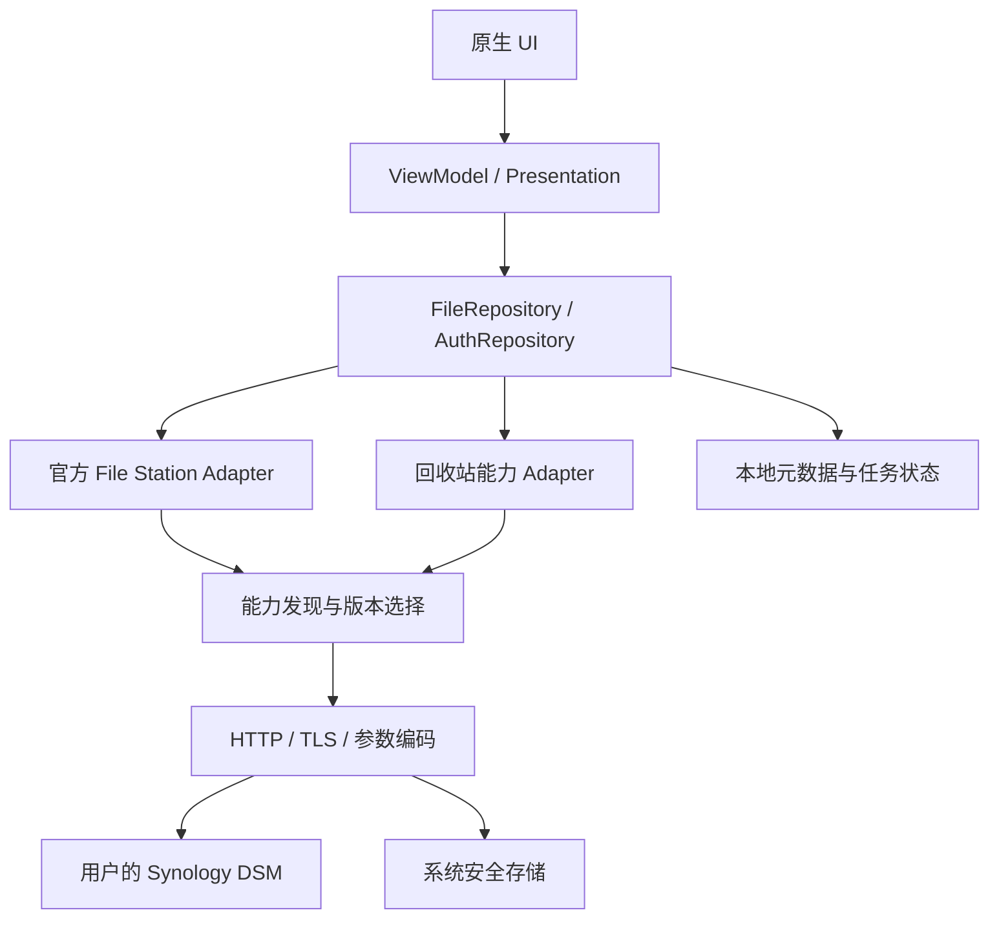
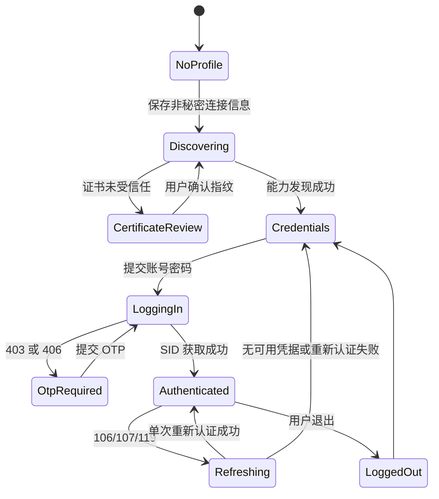
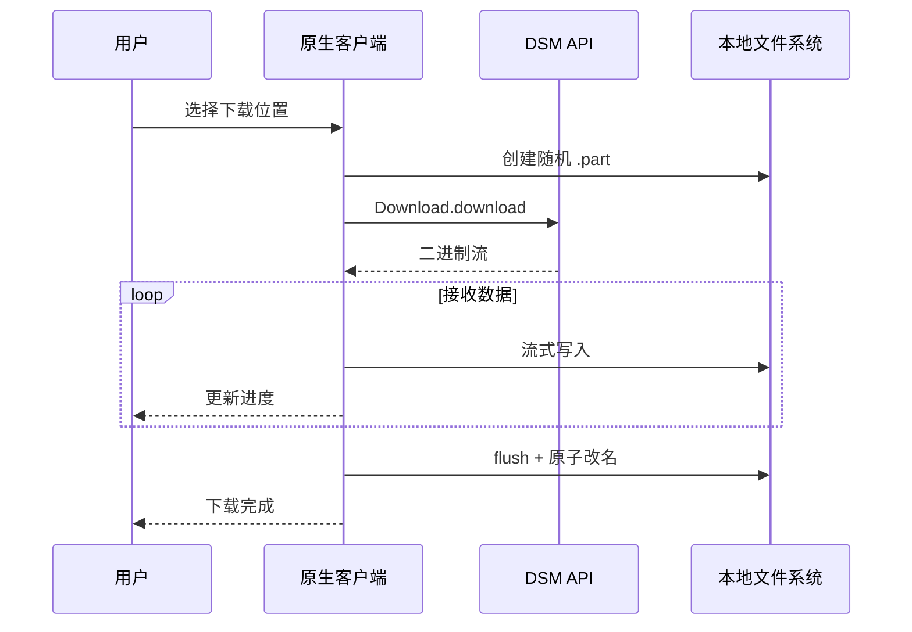
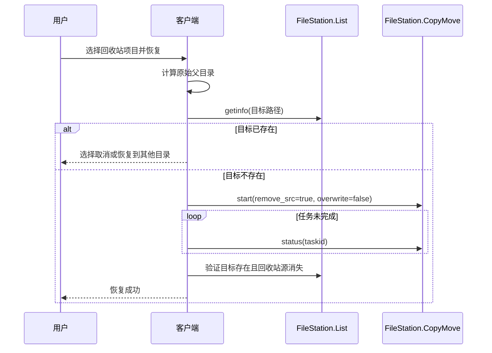

# 岚仓（LanStash）第一阶段开发文档

> 文档版本：1.0.0
> 编制日期：2026-07-16
> 目标平台：Windows、macOS、Android、iPhone、iPad
> 开发方式：平台原生，不使用 Flutter、React Native、Electron、MAUI 等跨平台 UI 运行时
> API 基线：[DSM Web API 原生应用开发参考](../api/DSM_WEB_API_REFERENCE_ZH.md)
> 第一阶段范围：登录、文件浏览、预览、下载、上传、删除、从回收站恢复

## 1. 文档目标

本文把第一阶段产品需求转换为可实现、可测试、可分批交付的工程规格。它同时约束 Apple、Android 和 Windows 三套原生代码，使同一功能在五种设备形态上具备一致的安全语义和 DSM 行为。

本文的交付目标不是“一次实现所有 NAS 管理能力”，而是先完成一个安全可靠的文件客户端闭环：

```text
连接 NAS -> 登录 -> 浏览共享目录 -> 预览文件
         -> 下载/上传 -> 删除 -> 在可恢复条件下从回收站恢复
```

## 2. 已确认的产品决策

| 决策 | 第一阶段选择 | 原因 |
| --- | --- | --- |
| 客户端模式 | 直接连接用户自己的 NAS | 不增加中转服务器和额外隐私暴露面 |
| UI 技术 | 各平台原生 | 获得原生文件选择器、后台传输、安全存储和窗口体验 |
| Apple 代码 | macOS、iOS、iPadOS 共享 Swift Package，UI 按设备适配 | 仍是原生实现，同时减少三套 Apple 协议代码重复 |
| API 策略 | 官方 File Station API 优先 | 稳定性和可维护性更高 |
| 内部 API | 默认关闭，只用于官方 API 无法完成且已抓包验证的能力 | 避免 DSM 更新后静默破坏 |
| 密码 | 只用于登录请求，不持久化 | 降低泄漏风险 |
| 会话 | SID、SynoToken 使用系统安全存储 | 支持重新打开应用，同时控制风险 |
| 删除 | 明确提示“可能永久删除”，删除后验证是否进入回收站 | 官方 API 没有承诺回收行为 |
| 回收站恢复 | 先以 `#recycle` 浏览和官方 `CopyMove` 方案验证；专用内部恢复接口暂不假定 | 公开 API 文档没有专门的 Restore API |
| 文件预览 | 首批支持图片、文本、PDF；媒体和更多格式随后扩展 | 先建立可靠的安全临时文件链路 |

## 3. 范围与非目标

### 3.1 第一阶段必须完成

| 编号 | 功能 | 最低交付能力 |
| --- | --- | --- |
| `AUTH` | 登录 | 地址、HTTPS、账号密码、OTP、退出、会话过期处理 |
| `BROWSE` | 文件浏览 | 共享文件夹、目录分页、刷新、排序、文件详情 |
| `PREVIEW` | 文件预览 | 图片、纯文本、PDF；不把 SID 放入外部 URL |
| `DOWNLOAD` | 下载 | 单文件、进度、取消、失败重试、原子落盘 |
| `UPLOAD` | 上传 | 单文件、进度、取消、重名策略、写权限检查 |
| `DELETE` | 删除 | 单个/批量、危险确认、异步任务状态、结果校验 |
| `RECYCLE` | 回收站 | 浏览 `#recycle`、计算目标、无冲突恢复、恢复结果校验 |

### 3.2 第一阶段明确不做

- 用户、群组、套件、Docker、虚拟机和系统设置管理。
- 公网中转、云同步服务或自建后端。
- 自动修改 DSM 防火墙、HTTPS、共享文件夹或回收站设置。
- 文件版本历史、Snapshot Replication、Hyper Backup 恢复。
- 多端实时同步、离线编辑、冲突合并。
- 未经验证的断点续传、分片上传和后台无限重试。
- 在应用内保存 DSM 明文密码。

### 3.3 推荐的平台最低范围

以下是工程起始基线，不是不可调整的产品承诺：

| 平台 | 推荐最低范围 | 调整原则 |
| --- | --- | --- |
| Windows | Windows 10 22H2、Windows 11 | 若只自用 Windows 11，可缩小兼容面 |
| macOS | macOS 14+ | 需要支持更老系统时单独评估 SwiftUI/Quick Look 差异 |
| iPhone/iPad | iOS/iPadOS 17+ | 与当前 Xcode 支持范围同步维护 |
| Android | Android 10 / API 29+ | 低版本会增加存储、TLS 和后台任务兼容成本 |

## 4. 分平台原生技术栈

| 层 | Apple：macOS/iOS/iPadOS | Android | Windows |
| --- | --- | --- | --- |
| 语言 | Swift | Kotlin | C# |
| UI | SwiftUI，必要时接入 AppKit/UIKit | Jetpack Compose | WinUI 3 |
| 并发 | Swift Concurrency | Kotlin Coroutines | async/await |
| HTTP | URLSession | OkHttp | HttpClient |
| JSON | Codable | kotlinx.serialization 或 Moshi，项目统一选一种 | System.Text.Json |
| 安全存储 | Keychain | Android Keystore 保护的加密存储 | Credential Locker 或 DPAPI 封装 |
| 文件选择 | fileImporter/NSOpenPanel | Storage Access Framework | FileOpenPicker/FileSavePicker |
| 后台任务 | Background URLSession | WorkManager + 前台服务规则 | Windows 后台传输或受控应用任务 |
| 图片 | ImageIO/Quick Look | ImageDecoder/图片加载库 | BitmapImage |
| PDF | PDFKit/Quick Look | PdfRenderer | WebView2 PDF 或系统关联预览 |
| 音视频扩展 | AVKit | Media3 | MediaPlayerElement |
| 本地数据 | SwiftData/Core Data 或轻量文件 | Room | SQLite |

技术约束：

- UI 不直接调用 HTTP 客户端。
- 不允许三端各自手写不同的表单转义规则。
- 不允许 Release 构建启用打印完整请求/响应的网络日志。
- Apple 平台可共享协议层和大部分业务层，但 macOS 与触屏 UI 分别设计。

## 5. 推荐仓库结构

```text
repository/
  docs/
    DSM_WEB_API_REFERENCE_ZH.md
    NATIVE_DSM_FILE_APP_DEVELOPMENT_PLAN_ZH.md
    decisions/
  contracts/
    api-capabilities.schema.json
    dsm-envelope.schema.json
    file-item.schema.json
    fixtures-redacted/
  apple/
    Package.swift
    Sources/DsmCore/
    Apps/macOS/
    Apps/iOS/
  android/
    app/
    core-network/
    core-domain/
    feature-files/
  windows/
    DsmClient.sln
    Dsm.Core/
    Dsm.Infrastructure/
    Dsm.App/
```

`contracts` 只保存协议定义和彻底脱敏的响应样本，不生成跨平台业务代码。每个平台独立实现和测试这些契约。

## 6. 总体架构



### 6.1 层职责

| 层 | 可以做 | 禁止做 |
| --- | --- | --- |
| UI | 展示、输入、确认、导航 | 拼接 API URL、保存 SID |
| ViewModel | 页面状态、用户意图、取消任务 | 直接解析 DSM JSON |
| Repository | 业务流程、缓存、恢复校验 | 绕过权限或证书策略 |
| API Adapter | API 参数与响应 DTO 映射 | 弹窗、平台文件选择 |
| HTTP | TLS、表单、multipart、重试、流式 I/O | 根据页面决定业务重试 |
| Secure Store | SID、SynoToken、DID | 保存明文密码 |
| Local Store | NAS 配置、能力缓存、传输元数据 | 保存响应正文或文件隐私日志 |

### 6.2 三端必须保持一致的契约

- API 路径发现与版本选择算法。
- `requestFormat=JSON` 参数编码规则。
- DSM 通用错误码到业务错误的映射。
- `FileItem`、`TransferTask`、`RecycleItem` 等领域模型语义。
- 日志脱敏规则和危险操作确认语义。
- 删除后是否可恢复的判定不能因平台不同而改变。

## 7. API 使用总览

| 业务能力 | API | 属性 | 第一阶段用途 |
| --- | --- | --- | --- |
| 能力发现 | `SYNO.API.Info.query` | 官方 | 路径、版本、请求格式 |
| 登录/退出 | `SYNO.API.Auth.login/logout/token` | 官方 | 会话与 SynoToken |
| File Station 状态 | `SYNO.FileStation.Info.get` | 官方 | 支持能力与用户信息 |
| 共享文件夹 | `SYNO.FileStation.List.list_share` | 官方 | 文件浏览根目录 |
| 目录列表 | `SYNO.FileStation.List.list` | 官方 | 分页浏览 |
| 文件详情 | `SYNO.FileStation.List.getinfo` | 官方 | 权限、大小、时间等 |
| 缩略图 | `SYNO.FileStation.Thumb.get` | 官方 | 图片列表和轻量预览 |
| 写权限 | `SYNO.FileStation.CheckPermission.write` | 官方 | 上传前校验 |
| 下载 | `SYNO.FileStation.Download.download` | 官方 | 原始二进制或 ZIP |
| 上传 | `SYNO.FileStation.Upload.upload` | 官方 | multipart 上传 |
| 删除 | `SYNO.FileStation.Delete.start/status/stop` | 官方 | 可监控删除 |
| 移动 | `SYNO.FileStation.CopyMove.start/status/stop` | 官方 | 回收站恢复候选方案 |
| 回收站配置 | `SYNO.Core.Share.list/get` | 内部、可选 | 读取 `enable_recycle_bin` 状态 |
| 清空回收站 | `SYNO.Core.RecycleBin.start` | 内部，不属于首批恢复 | 仅后续管理员功能 |

`SYNO.Core.RecycleBin` 在项目源码中用于清空回收站，不是“恢复文件”接口。第一阶段不能把它用于恢复。

## 8. 通用协议规范

### 8.1 地址模型

```text
scheme: https
host: nas.example.com 或 IP
port: 5001 或用户自定义端口
baseURL: https://nas.example.com:5001
apiURL: <baseURL>/webapi/<SYNO.API.Info 返回的 path>
```

保存 NAS 配置时必须将 scheme、host、port 分字段保存，不保存带密码、SID 或查询参数的 URL。

### 8.2 启动能力发现

1. 请求 `/webapi/entry.cgi` 的 `SYNO.API.Info.query`。
2. 如果明确返回入口不存在或老 DSM 不兼容，再回退 `/webapi/query.cgi`。
3. 查询第一阶段所需 API，不建议每次 `query=all`。
4. 缓存 `path`、`minVersion`、`maxVersion`、`requestFormat`。
5. DSM build、File Station 版本、主机或端口变化时清空缓存。

首批查询列表：

```text
SYNO.API.Auth,
SYNO.FileStation.Info,
SYNO.FileStation.List,
SYNO.FileStation.Thumb,
SYNO.FileStation.CheckPermission,
SYNO.FileStation.Download,
SYNO.FileStation.Upload,
SYNO.FileStation.Delete,
SYNO.FileStation.CopyMove
```

### 8.3 版本选择

```text
lower = max(server.minVersion, client.minSupportedVersion)
upper = min(server.maxVersion, client.maxTestedVersion)

如果 lower <= upper：选择 upper
否则：该功能不可用
```

客户端只能选择已经实现并测试的版本，不能无条件采用服务器最高版本。

### 8.4 参数编码

- 默认使用 HTTPS POST。
- 普通 API 使用 `application/x-www-form-urlencoded`。
- 上传使用 `multipart/form-data`，文件 part 必须最后发送。
- `requestFormat=JSON` 时，业务参数按 JSON 值编码后再放入表单字段。
- 统一编码器必须正确处理中文、空格、`#`、`+`、`&`、`=`、引号和 emoji。
- 原始 DSM 路径统一使用 `/`，不得使用 Windows 的反斜杠。

### 8.5 通用响应

```json
{
  "success": true,
  "data": {}
}
```

```json
{
  "success": false,
  "error": {
    "code": 105,
    "errors": []
  }
}
```

二进制接口的判断顺序：HTTP 状态、Content-Type、响应头、二进制流。不要把下载错误页面当作文件保存。

### 8.6 请求上下文

每个请求在本地生成随机 `requestId`，只用于关联本地日志和 UI 状态，不发送用户文件信息。请求上下文至少包含：

```text
requestId
nasProfileId
apiClass
isWriteOperation
startedAt
cancellationHandle
```

## 9. 统一领域模型

### 9.1 `NasProfile`

| 字段 | 类型 | 敏感 | 说明 |
| --- | --- | --- | --- |
| `id` | UUID | 否 | 本地生成 |
| `displayName` | String | 低 | 用户自定义名称 |
| `scheme` | Enum | 否 | 第一阶段只允许 `https` |
| `host` | String | 是 | NAS 域名或 IP |
| `port` | Int | 低 | DSM 端口 |
| `usernameHint` | String? | 是 | 可选，只用于提示，不保存密码 |
| `certificateTrust` | Object | 高 | 首次信任的主机和指纹信息 |
| `lastDsmBuild` | String? | 低 | 用于能力缓存失效 |

### 9.2 `ApiCapability`

```text
name: String
path: String
minVersion: Int
maxVersion: Int
requestFormat: FORM | JSON
selectedVersion: Int?
verified: Boolean
```

### 9.3 `AuthSession`

| 字段 | 存储位置 | 生命周期 |
| --- | --- | --- |
| `sid` | 系统安全存储 | 退出、会话无效或删除 NAS 时清理 |
| `synoToken` | 系统安全存储 | 与 SID 同生命周期 |
| `did` | 系统安全存储 | 仅用户明确启用可信设备时保存 |
| `account` | 普通配置或仅内存 | 由用户“记住账号”选择决定 |
| `password` | 仅内存 | 登录完成后立即释放 |
| `otpCode` | 仅内存 | 一次请求后立即释放 |

### 9.4 `FileItem`

```text
id: nasProfileId + normalizedPath
name: String
path: String
kind: file | directory | symlink | unknown
sizeBytes: Int64?
mimeType: String?
extension: String?
owner: OwnerInfo?
times: FileTimes?
permissions: FilePermissions?
thumbnailAvailable: Boolean?
isRecyclePath: Boolean
rawType: String?
```

`id` 只用于本地列表稳定性，不作为服务端永久标识。重命名或移动后必须重新生成。

### 9.5 `FilePage`

```text
folderPath: String
items: List<FileItem>
offset: Int
total: Int
hasMore: Boolean
loadedAt: Instant
```

### 9.6 `TransferTask`

```text
id: UUID
direction: upload | download
remotePath: String
localHandle: 平台安全文件句柄或书签
displayName: String
totalBytes: Int64?
completedBytes: Int64
state: queued | running | paused | cancelling | succeeded | failed | cancelled
retryCount: Int
failure: AppError?
createdAt: Instant
```

本地数据库不得保存可被其他进程直接滥用的永久文件访问令牌；使用平台规定的持久授权机制。

### 9.7 `RecycleItem`

```text
file: FileItem
sharePath: String
recycleRoot: String
relativePath: String
computedOriginalPath: String?
restoreCapability: unavailable | needsVerification | restorable | conflict
```

原始位置候选计算：

```text
recyclePath = /share/#recycle/folder/file.txt
recycleRoot = /share/#recycle
relativePath = /folder/file.txt
computedOriginalPath = /share/folder/file.txt
```

该计算只产生“候选路径”，恢复前仍要检查权限、父目录和目标冲突。

## 10. 登录功能规格

### 10.1 功能需求

| 编号 | 需求 | 优先级 |
| --- | --- | --- |
| `AUTH-001` | 用户可新增 NAS，输入 HTTPS 地址、端口、账号和密码 | P0 |
| `AUTH-002` | 连接前发现 API 能力并选择兼容版本 | P0 |
| `AUTH-003` | 支持 DSM 普通账号登录 | P0 |
| `AUTH-004` | 收到 403/406 时进入 OTP 流程 | P0 |
| `AUTH-005` | SID、SynoToken 安全存储，密码不落盘 | P0 |
| `AUTH-006` | 支持退出并清理本地会话 | P0 |
| `AUTH-007` | 106/107/119 时只执行一次受控重新认证 | P0 |
| `AUTH-008` | 支持自签名证书首次信任与证书变化警告 | P0 |
| `AUTH-009` | 支持多个 NAS 配置，秘密互相隔离 | P1 |
| `AUTH-010` | 可信设备 DID 由用户显式开启，默认关闭 | P1 |

### 10.2 登录状态机



### 10.3 登录请求

运行时先查询 `SYNO.API.Auth`，客户端第一阶段实现 version 6，并允许服务器协商到已测试的较低版本。

```text
api=SYNO.API.Auth
version=<selectedVersion>
method=login
account=<username>
passwd=<password>
session=FileStation
format=sid
enable_syno_token=yes
otp_code=<仅需要时发送>
```

macOS 后续请求在 HTTPS 请求头中发送 `Cookie: id=<SID>`，同时在 POST 正文保留 `_sid=<SID>` 作为 DSM 版本兼容路径。两者必须一致，且不得进入 URL、日志或持久化 Cookie 存储。iPhone/iPad 复用该 Apple 共享实现；Android 和 Windows 后续按同一安全边界实现。

成功后读取：

```text
data.sid
data.synotoken
data.did
data.is_portal_port
```

### 10.4 登录错误 UX

| DSM 错误 | 客户端行为 | 禁止行为 |
| --- | --- | --- |
| `400` | 提示账号或密码错误 | 在日志中区分账号存在与否 |
| `401` | 提示账号已禁用 | 自动改用管理员账号 |
| `402`/`105` | 提示权限不足 | 无限重试 |
| `403`/`406` | 显示 OTP 页面 | 把 OTP 写入剪贴板或日志 |
| `404` | 提示 OTP 不正确，可重新输入 | 自动重放旧 OTP |
| `407` | 提示来源 IP 被阻止 | 快速循环登录 |
| `409`/`410` | 引导用户在 DSM 官方界面修改密码 | 在客户端尝试未知改密接口 |
| `106`/`107`/`119` | 清理旧会话并受控重登一次 | 对写操作盲目重放 |
| `150` | 提示网络切换或代理造成 IP 不一致 | 自动重复写操作 |

### 10.5 证书信任

第一阶段必须区分：

1. 系统信任的有效证书：直接连接。
2. 自签名或私有 CA：显示主机、颁发者、有效期、SHA-256 指纹，用户明确确认后保存主机绑定。
3. 已信任主机的证书指纹变化：阻止连接并显示高风险告警。
4. 主机名不匹配：默认阻止，不能用“忽略所有错误”代替主机绑定。

Release 构建中不得存在全局信任任意证书的代码路径。

### 10.6 登录验收标准

- 正常账号可完成登录、关闭应用后恢复安全会话、手动退出。
- 密码和 OTP 不出现在普通配置、数据库、日志、崩溃报告和系统备份中。
- 自签名证书首次连接有明确指纹确认，证书变化会阻止静默连接。
- OTP 错误后可重试，但不会重放旧验证码。
- 会话过期时只读请求可重新认证后重试一次；写请求需先确认服务端状态。
- 删除 NAS 配置会删除 SID、SynoToken、DID、证书绑定和能力缓存。

## 11. 文件浏览功能规格

### 11.1 功能需求

| 编号 | 需求 | 优先级 |
| --- | --- | --- |
| `BROWSE-001` | 登录后展示当前账号可见共享文件夹 | P0 |
| `BROWSE-002` | 进入目录并分页加载文件和子目录 | P0 |
| `BROWSE-003` | 支持下拉/按钮刷新、返回上级和路径导航 | P0 |
| `BROWSE-004` | 支持按名称、大小、修改时间排序 | P0 |
| `BROWSE-005` | 展示名称、类型、大小、修改时间 | P0 |
| `BROWSE-006` | 权限允许时支持多选 | P0 |
| `BROWSE-007` | 展示文件详情和可执行操作 | P1 |
| `BROWSE-008` | 列表支持缩略图的渐进加载 | P1 |
| `BROWSE-009` | 记住每台 NAS 最近目录，但不泄漏到跨设备同步 | P1 |

### 11.2 共享文件夹请求

```text
api=SYNO.FileStation.List
version=<selectedVersion <= 2>
method=list_share
offset=0
limit=100
sort_by=name
sort_direction=asc
additional=["size","time","perm","mount_point_type","volume_status"]
```

共享列表必须分页，不能假定一次返回全部。响应模型只保留 UI 需要的字段；未知字段忽略。

### 11.3 目录列表请求

```text
api=SYNO.FileStation.List
version=<selectedVersion <= 2>
method=list
folder_path=/share/folder
offset=0
limit=200
sort_by=name
sort_direction=asc
additional=["size","time","perm","type","mount_point_type"]
```

推荐每页 100-200 项。桌面端可在用户滚动时提前加载下一页；移动端保守预取，避免蜂窝网络浪费。

### 11.4 路径规则

- 所有 DSM 路径必须是以共享文件夹开头的绝对路径，如 `/photo/2026/a.jpg`。
- 根共享路径不能通过普通删除操作删除。
- 不能把 `..`、`.` 或空路径交给服务端。
- 规范化只处理分隔符和明显冗余，不改变大小写和 Unicode 规范形式。
- 文件名展示与真实路径分离，禁止从显示文本重新拼接路径。
- `#recycle` 是真实特殊目录，普通浏览默认隐藏，回收站入口单独展示。

### 11.5 排序和分页一致性

目录在分页期间可能变化。客户端应：

1. 使用服务端排序。
2. 以 `path` 去重，不以列表位置去重。
3. 刷新时从 offset 0 重建当前页面。
4. 上传、删除、恢复成功后主动刷新受影响目录。
5. 如果 `total` 与已加载数量出现异常，提供刷新而不是无限请求。

### 11.6 权限映射

`additional.perm` 映射为业务能力：

```text
canRead
canWrite
canDelete
canRename
canDownload
```

映射无法确认时采用保守策略：隐藏写操作，但仍允许用户刷新权限。服务端 `105` 始终是最终判定。

### 11.7 浏览验收标准

- 共享文件夹与目录能在 0 项、1 项、数千项场景正确显示。
- 中文、emoji、空格、`#`、`+`、引号和超长文件名不会破坏导航。
- 快速切换目录时，旧请求结果不能覆盖新页面。
- 会话过期、无权限、共享离线和网络断开都有独立错误状态。
- 列表刷新不会重复项目，上传/删除后列表能反映真实状态。

## 12. 文件预览功能规格

### 12.1 预览分级

| 级别 | 类型 | 第一阶段方式 | 网络策略 |
| --- | --- | --- | --- |
| A | JPEG、PNG、GIF、HEIC 等图片 | 先 Thumb，用户打开时下载原图临时预览 | 缩略图按需加载 |
| A | PDF | 下载到安全临时文件后使用平台原生 PDF 组件 | 限制并发和缓存大小 |
| A | TXT、JSON、XML、日志、常见代码文件 | 下载有限大小后只读显示 | 默认最大预览 5 MiB，可配置 |
| B | 音频 | 后续使用受控缓存或认证资源加载器 | 不把 SID 放入播放器 URL |
| B | 视频 | macOS 已实现带认证的 Range 分段读取，其他平台后续适配 | NAS 不返回 `206` 时停止流式播放并提示下载 |
| C | Office、压缩包、未知格式 | 展示详情并允许下载/系统打开 | 不在应用内解析 |

### 12.2 缩略图

```text
api=SYNO.FileStation.Thumb
version=<selectedVersion <= 2>
method=get
path=/photo/a.jpg
size=small|medium|large
rotate=0
```

响应是图片二进制。缓存键至少包含：NAS ID、路径、修改时间、请求尺寸。SID 不得进入缓存键或文件名。

### 12.3 安全临时文件

预览非缩略图文件时：

1. 在应用私有缓存目录创建随机名称的 `.part`。
2. 流式下载并校验响应类型、大小和取消状态。
3. 下载成功后原子改名为内部随机 ID，可保留正确扩展名供系统预览器识别。
4. 文件保护权限设为仅当前应用/用户可访问。
5. 退出账号、删除 NAS、缓存超限或到期时清理。
6. 外部分享必须由用户明确触发，不能把私有缓存路径自动交给第三方。

平台实现：

- Apple：Quick Look/PDFKit 使用本地临时文件；iOS/iPadOS 配置文件保护。
- Android：使用应用 cacheDir、FileProvider 和只读临时授权。
- Windows：使用应用本地缓存和受限 ACL，不写入公共 Downloads 目录。

### 12.4 文本预览安全

- 自动探测 UTF-8/UTF-16，失败时允许用户选择编码。
- 不执行 HTML、JavaScript、宏或嵌入对象。
- JSON/XML 只做文本高亮，不解析外部实体。
- 大于限制的文件只显示前一段并提供下载，不一次读入内存。
- 预览内容不进入搜索索引、剪贴板或遥测。

### 12.5 预览验收标准

- 图片缩略图失败不会阻塞目录列表。
- PDF、文本和原图预览不会在 URL、日志或第三方组件中暴露 SID。
- 100 MiB PDF 不会一次性加载到进程内存；应由文件和原生组件处理。
- 用户切换账号后，旧账号缓存不能继续打开。
- 不支持的类型明确显示“下载或使用其他应用打开”。

## 13. 下载功能规格

### 13.1 功能需求

| 编号 | 需求 | 优先级 |
| --- | --- | --- |
| `DOWNLOAD-001` | 单文件下载到用户选择的位置 | P0 |
| `DOWNLOAD-002` | 显示等待、进度、速率、成功、失败和取消 | P0 |
| `DOWNLOAD-003` | 临时文件完成后原子落盘 | P0 |
| `DOWNLOAD-004` | 重名时询问覆盖、改名或取消 | P0 |
| `DOWNLOAD-005` | App 进入后台后按平台规则继续或安全暂停 | P1 |
| `DOWNLOAD-006` | 多文件/文件夹 ZIP 下载 | P1 |
| `DOWNLOAD-007` | 已验证服务器支持后提供断点续传 | P2 |

### 13.2 请求

```text
api=SYNO.FileStation.Download
version=<selectedVersion <= 2>
method=download
path=["/share/folder/file.bin"]
mode=download
```

单个文件返回原始文件流；多个文件或目录通常返回 ZIP。MVP 的单文件下载和多文件 ZIP 必须使用不同任务类型，不根据扩展名猜测响应。

### 13.3 下载流程



### 13.4 完整性与错误处理

- 如果有可信 `Content-Length`，完成后比较文件大小。
- 用户要求强校验时可调用 `SYNO.FileStation.MD5`，但不作为每次下载默认步骤。
- HTTP 200 不代表一定是文件；必须排除 JSON 错误信封和 HTML 错误页。
- 网络中断保留 `.part` 的策略由任务决定，但不得把未完成文件伪装为成功文件。
- 官方文档没有承诺 HTTP Range，因此断点续传在实机验证前保持关闭。
- 用户取消时停止网络请求、关闭句柄并按设置删除 `.part`。

### 13.5 下载验收标准

- 0 字节、小文件、数 GiB 文件都使用流式 I/O。
- 取消后不会留下看似完整的目标文件。
- 本地空间不足、无写权限、文件已存在、NAS 断开均有明确提示。
- 文件名包含平台非法字符时由保存选择器让用户决定，不静默改变远程文件名。
- 任务完成后可从系统文件管理器打开目标位置。

## 14. 上传功能规格

### 14.1 功能需求

| 编号 | 需求 | 优先级 |
| --- | --- | --- |
| `UPLOAD-001` | 通过平台文件选择器选择单个文件上传 | P0 |
| `UPLOAD-002` | 上传前检查目录写权限 | P0 |
| `UPLOAD-003` | 支持覆盖、跳过和取消重名决策 | P0 |
| `UPLOAD-004` | 显示进度、取消和错误状态 | P0 |
| `UPLOAD-005` | 上传成功后刷新当前目录并校验文件 | P0 |
| `UPLOAD-006` | 多文件队列和有限并发 | P1 |
| `UPLOAD-007` | 目录递归上传 | P2 |
| `UPLOAD-008` | 已验证后支持分片或断点续传 | P2 |

### 14.2 上传前检查

```text
api=SYNO.FileStation.CheckPermission
version=<selectedVersion <= 3>
method=write
path=/share/target
filename=file.bin
create_only=true
```

检查成功仍不能替代最终上传结果，因为权限、空间和同名文件可能在上传期间变化。

### 14.3 multipart 规范

```text
api=SYNO.FileStation.Upload
version=<selectedVersion <= 2>
method=upload
path=/share/target
create_parents=false
overwrite=true|false
mtime=<可选毫秒时间戳>
file=<最后一个 multipart part>
```

文件二进制 part 必须最后发送。HTTP 层需提供真正的流式 multipart body，禁止为计算请求体而把整个文件读入内存。

### 14.4 重名策略

| 用户选择 | 请求行为 | 上传后行为 |
| --- | --- | --- |
| 覆盖 | `overwrite=true` | 获取详情并确认大小/时间 |
| 跳过 | 不发上传请求 | 任务标记为 skipped，而非 succeeded |
| 取消 | 取消当前任务 | 不影响其他队列任务 |
| 保留两份 | 第一阶段让用户修改目标名；后续自动生成唯一名 | 使用最终名称检查权限 |

### 14.5 后台与重试

- 官方 Upload API 没有公开断点续传契约，网络中断后默认从头重新上传。
- 自动重试最多一次且仅限明确没有服务端成功结果的只读准备阶段。
- 上传写入发生后连接断开，先用 `getinfo` 检查目标文件再决定是否重试。
- Android 长任务遵守前台服务通知规则；Apple 使用文件型后台上传；Windows 使用受控后台传输或保持前台任务。
- 本地文件授权失效时要求用户重新选择，不能绕过平台沙箱。

### 14.6 上传验收标准

- 上传 0 字节、中文名、大文件、同名文件和只读目录行为正确。
- 任一平台上传大文件时内存保持稳定。
- 用户取消后连接终止，目录刷新能反映服务端实际结果。
- 覆盖操作必须二次确认且默认关闭。
- 网络日志中不出现本地完整路径、远程路径、SID 或文件内容。

## 15. 删除功能规格

### 15.1 重要语义

`SYNO.FileStation.Delete` 的公开文档只承诺删除文件/目录，没有公开保证“必定进入回收站”。DSM 的实际行为还取决于共享文件夹是否启用回收站、用户权限、路径类型和 DSM 版本。

因此第一阶段必须把 UI 文案设计为：

```text
删除后能否恢复取决于此共享文件夹的回收站设置。
如果回收站未启用或当前账号无权访问，文件可能被永久删除。
```

### 15.2 功能需求

| 编号 | 需求 | 优先级 |
| --- | --- | --- |
| `DELETE-001` | 删除单个文件或空/非空目录 | P0 |
| `DELETE-002` | 删除前显示 NAS、共享、数量和路径摘要 | P0 |
| `DELETE-003` | 批量删除使用异步任务并逐项处理错误 | P0 |
| `DELETE-004` | 删除后检查源路径消失 | P0 |
| `DELETE-005` | 能验证回收站路径时显示“可恢复” | P1 |
| `DELETE-006` | 在 `#recycle` 中再次删除时显示“永久删除” | P0 |

### 15.3 请求

```text
api=SYNO.FileStation.Delete
version=<selectedVersion <= 2>
method=start
path=["/share/folder/file.txt"]
recursive=true
accurate_progress=true
```

返回 `taskid` 后轮询：

```text
api=SYNO.FileStation.Delete
version=<selectedVersion <= 2>
method=status
taskid=<taskid>
```

用户取消时调用 `stop`，但必须提示“已经处理的项目可能无法撤销”。

### 15.4 删除结果确认

1. `finished=true` 后刷新源目录。
2. 源项目仍存在时显示部分失败，不标记成功。
3. 若回收站功能已验证，查询计算出的 `#recycle` 候选路径。
4. 找到候选项后标记“可从回收站恢复”。
5. 找不到时只显示“已删除”，不能承诺可恢复。

### 15.5 删除验收标准

- 默认确认按钮不是焦点，键盘快捷键不会误触永久删除。
- 多选删除显示数量和父目录，不打印全部敏感路径到日志。
- 回收站内删除使用不同颜色、标题和文案，并要求额外确认。
- 部分成功时保留失败项选择状态，方便用户处理。
- 超时后先查询任务/目录状态，绝不立即重复删除请求。

## 16. 回收站浏览与恢复规格

### 16.1 已确认事实

- 群晖官方知识库说明：启用共享文件夹回收站后会创建 `#recycle` 子目录。
- DSM 7.1 及以上的 File Station UI 支持把其中项目恢复到原位置。
- 当前公开 File Station Web API 指南没有列出专门的回收站恢复 API。
- `dsm_helper` 只实现 `SYNO.Core.Share` 的回收站状态和 `SYNO.Core.RecycleBin.start` 清空操作，没有实现文件恢复。
- 项目套件信息中的 `SYNO.SDS.RecycleBin.Restore.FBExt` 是 File Station 前端扩展标识，不能直接视为可调用 API。

### 16.2 第一阶段恢复策略

采用“两步验证、官方操作优先”：

1. 把 `#recycle` 当作特殊目录，通过 `SYNO.FileStation.List` 浏览。
2. 计算候选原始路径。
3. 在测试 NAS 上验证 `SYNO.FileStation.CopyMove` 使用 `remove_src=true` 是否能安全恢复。
4. 只有契约测试通过的 DSM build 才开启“恢复到原位置”。
5. 没有验证时只提供“恢复到指定目录”，或暂时只允许下载回收站文件。
6. 如果 DSM Web UI 使用专用内部恢复接口，必须完成抓包、脱敏、版本矩阵和失败降级后再单独适配。

### 16.3 回收站能力发现

优先级从高到低：

1. 尝试列出 `/<share>/#recycle`，成功即证明当前账号可访问。
2. 可选调用内部 `SYNO.Core.Share.list/get` 并请求 `recyclebin`，读取 `enable_recycle_bin` 和 `recycle_bin_admin_only`。
3. 内部接口不存在或无权限时，不影响普通文件功能。
4. 回收站目录不存在、不可读或共享为 WriteOnce 时，关闭恢复入口。

不能要求用户为了恢复功能改用管理员账号。

### 16.4 候选恢复流程



请求候选：

```text
api=SYNO.FileStation.CopyMove
version=<selectedVersion <= 3>
method=start
path=["/share/#recycle/folder/file.txt"]
dest_folder_path=/share/folder
remove_src=true
overwrite=false
accurate_progress=true
```

这不是群晖公开的专用“Restore”契约，只是使用官方移动 API 实现等价文件操作，必须经过实机验证后开启。

### 16.5 恢复前置条件

- 源路径位于严格规范化后的 `/<share>/#recycle/` 下。
- 目标路径仍位于同一个共享文件夹，除非用户选择“恢复到其他位置”。
- 当前用户对回收站源有读/删除权限，对目标父目录有写权限。
- 目标父目录存在；第一阶段不自动创建缺失的多级目录，除非已单独确认。
- 目标同名文件不存在。
- `CopyMove` API 已在当前 DSM build 和 File Station 版本通过验证。

### 16.6 冲突策略

| 场景 | 第一阶段处理 |
| --- | --- |
| 目标不存在 | 恢复到原位置 |
| 目标已存在 | 默认拒绝覆盖，提供恢复到其他目录 |
| 原父目录不存在 | 选择现有目录；自动重建延后 |
| 无目标写权限 | 禁用恢复并解释权限原因 |
| 回收站只限管理员 | 普通用户看不到入口，不提示改用管理员 |
| 源项目在操作期间消失 | 刷新并提示已被其他客户端处理 |
| 跨共享恢复 | 视为普通移动，第一阶段不称为“恢复到原位置” |

覆盖恢复属于后续能力。即使添加，也必须先备份/重命名现有目标或要求明确的二次确认。

### 16.7 专用恢复接口抓包任务

在测试 NAS 的 DSM 7.1+ File Station 中：

1. 新建测试共享并启用回收站。
2. 创建唯一测试文件并删除。
3. 打开浏览器开发者工具，只记录一次“恢复”动作。
4. 记录 API 名称、version、method、参数、成功响应和冲突响应。
5. 检查是否为 `SYNO.Entry.Request` 包装的复合请求。
6. 用普通用户和管理员分别验证权限。
7. 在至少两个 DSM 7 build 上复测。
8. 脱敏后把契约保存到 `contracts/fixtures-redacted`。

未完成上述任务前，代码中不得添加猜测的 `SYNO.FileStation.Restore` 名称。

### 16.8 恢复验收标准

- 只显示当前账号实际可访问的回收站。
- 从 `#recycle` 到目标目录的路径计算覆盖中文、嵌套目录和特殊字符。
- 目标冲突时默认不覆盖。
- 恢复完成必须同时验证目标存在和回收站源消失。
- 未通过版本验证的 NAS 不显示“恢复到原位置”，但可提供下载抢救文件。
- 恢复失败不会触发删除或清空回收站。

## 17. 页面与交互设计

### 17.1 公共页面

| 页面 | 核心内容 |
| --- | --- |
| NAS 列表 | 已配置 NAS、在线状态、新增、编辑、删除 |
| 连接设置 | HTTPS 地址、端口、账号提示、证书状态 |
| 登录 | 密码、OTP、错误处理、可信设备选项 |
| 文件主页 | 共享文件夹、最近目录、传输入口、回收站入口 |
| 文件浏览 | 路径、列表/网格、排序、刷新、多选、操作菜单 |
| 文件详情 | 大小、时间、类型、权限、远程路径 |
| 预览 | 图片/PDF/文本、下载、外部打开 |
| 传输中心 | 上传/下载队列、进度、取消、失败重试 |
| 回收站 | 按共享筛选、候选原路径、恢复/下载/永久删除 |
| 设置 | 缓存、蜂窝网络、证书、日志、关于 |

### 17.2 Windows 与 macOS 桌面布局

采用三栏结构：

```text
左栏：NAS / 共享 / 回收站
中栏：文件列表或网格
右栏：详情或预览
底部/独立窗口：传输任务
```

桌面交互要求：

- 支持 Ctrl/Cmd 多选、Shift 连选、Enter 打开、Backspace 返回上级。
- Delete 键只打开确认框，不能直接提交删除。
- 支持拖入上传；拖出下载延后到 P1，避免临时文件语义不清。
- 窗口恢复时只恢复导航状态，不自动重放写操作。
- Windows 路径和 DSM 路径始终分开显示与处理。

### 17.3 iPhone 布局

- 使用导航栈：NAS -> 共享 -> 目录 -> 预览。
- 长按项目打开上下文菜单，编辑模式用于多选。
- 传输中心在工具栏提供持续可见的状态入口。
- 删除和覆盖使用系统确认对话框，危险按钮置于破坏性操作区域。
- 默认不在蜂窝网络预加载大缩略图或原文件。

### 17.4 iPad 布局

- 使用 `NavigationSplitView`：侧栏显示 NAS/共享，中栏文件列表，详情栏预览。
- 支持键盘快捷键、指针、拖放和多窗口；第一阶段拖放只做本地文件上传。
- 每个窗口拥有独立导航路径，共享同一会话和传输队列。
- 分屏尺寸变化不能使选择状态丢失或触发重复请求。

### 17.5 状态显示规范

每个功能页面必须明确区分：

```text
initial / loading / content / empty / refreshing / partial / error / offline
```

禁止使用一个无限旋转指示器覆盖所有状态。错误页面必须保留“重试”“返回”和必要时的“重新登录”。

## 18. 领域接口定义

三端按本节语义分别实现，命名可符合平台习惯。

### 18.1 `AuthRepository`

```text
discover(profile) -> CapabilitySet
login(profileId, account, password, otp?) -> AuthSession
refreshToken(profileId) -> AuthSession
restoreSession(profileId) -> SessionState
logout(profileId) -> Result
deleteProfile(profileId) -> Result
```

### 18.2 `FileRepository`

```text
listShares(profileId, pageRequest) -> FilePage
listFolder(profileId, folderPath, pageRequest) -> FilePage
getInfo(profileId, paths) -> List<FileItem>
getThumbnail(profileId, path, size) -> BinaryResource
refreshFolder(profileId, folderPath) -> FilePage
```

### 18.3 `PreviewRepository`

```text
classify(fileItem) -> PreviewKind
preparePreview(profileId, fileItem) -> PreviewResource
releasePreview(resourceId) -> Result
purgeExpiredCache(profileId?) -> Result
```

### 18.4 `TransferRepository`

```text
enqueueDownload(profileId, remotePath, localDestination) -> TransferTask
enqueueUpload(profileId, localHandle, remoteFolder, conflictPolicy) -> TransferTask
observeTasks(profileId?) -> Stream<List<TransferTask>>
cancel(taskId) -> Result
retry(taskId) -> TransferTask
removeCompleted(taskId) -> Result
```

### 18.5 `DeleteRepository`

```text
prepareDelete(profileId, paths) -> DeletePlan
executeDelete(deletePlan) -> OperationTask
observeDelete(taskId) -> Stream<OperationProgress>
cancelDelete(taskId) -> Result
verifyDelete(deletePlan) -> DeleteVerification
```

### 18.6 `RecycleRepository`

```text
discoverRecycleBins(profileId) -> List<RecycleRoot>
listRecycleFolder(profileId, recyclePath, pageRequest) -> FilePage
prepareRestore(profileId, recycleItems, destination?) -> RestorePlan
executeRestore(restorePlan) -> OperationTask
verifyRestore(restorePlan) -> RestoreVerification
```

`prepareDelete` 和 `prepareRestore` 必须是纯规划阶段，不产生服务端修改。UI 只有在展示计划并得到确认后才调用执行接口。

## 19. 状态管理与并发规则

### 19.1 单一状态来源

- 当前目录内容由 `FileRepository` 提供，ViewModel 不维护第二份可变文件数组。
- 传输任务由全局 `TransferRepository` 持有，页面只是订阅者。
- 会话状态按 NAS 隔离，切换 NAS 不复用 SID。
- 能力缓存带 NAS ID 和 DSM build，不跨 NAS 共用。

### 19.2 请求竞争

目录页面为每次导航生成 `navigationGeneration`：

```text
发起请求时记录 generation
响应返回时仅当 generation == 当前值才更新 UI
```

上传、删除和恢复属于写操作，不能因页面销毁而自动重发。任务进入 Repository 后独立完成或由用户取消。

### 19.3 写操作互斥

以下操作在相同远程路径上必须互斥：

- 上传覆盖与删除。
- 删除与恢复。
- 两个恢复任务写入同一目标。
- 预览临时下载与删除可以并行，但删除完成后预览标记为历史快照。

互斥键使用规范化的 NAS ID + 路径，不使用文件名。

### 19.4 前后台切换

- 只读列表请求可取消并在返回前台时刷新。
- 正在传输的任务按平台规则继续；无法继续时保存“需要恢复”状态。
- 删除/恢复任务返回前台后先查询服务端任务状态和目录状态。
- 不把 App 进程存活视为服务端任务存活的唯一依据。

## 20. 错误模型与重试策略

### 20.1 统一错误类型

```text
NetworkUnavailable
Timeout
TlsUntrusted
TlsCertificateChanged
AuthenticationRequired
OtpRequired
PermissionDenied
ApiUnavailable
VersionUnsupported
NotFound
Conflict
LocalStorageFull
RemoteStorageFull
ServerBusy
PartialFailure
Cancelled
InvalidResponse
Unknown
```

每个 `AppError` 包含：

```text
category
isRetryable
safeUserMessage
dsmCode?
httpStatus?
requestId
```

不得包含密码、SID、Token、真实路径、响应正文和用户名。

### 20.2 重试矩阵

| 操作 | 自动重试 | 条件 |
| --- | --- | --- |
| 能力发现 | 最多 2 次 | 超时或暂时网络错误，指数退避 |
| 目录列表 | 最多 2 次 | 幂等且页面仍有效 |
| 缩略图 | 最多 1 次 | 页面仍显示该项目 |
| 下载 | 最多 1 次 | 未提交为完整文件；断点行为另行验证 |
| 上传 | 默认不自动重传文件体 | 先查询目标状态 |
| 删除 | 不自动重发 | 先查询任务和源路径 |
| 恢复 | 不自动重发 | 先查询源与目标路径 |
| 登录 | 用户输入错误不重试 | 防止账号锁定 |

退避建议：500 ms、1 s、2 s，并加入小幅随机抖动。用户主动点击重试不绕过总次数和账号保护。

### 20.3 部分失败

批量操作返回逐项结果：

```text
succeededPaths
failedItems: pathId + errorCategory
unknownItems
```

UI 可以显示脱敏的文件显示名，但日志只记录数量和错误分类。

## 21. 安全与隐私要求

### 21.1 凭据和会话

- 密码、OTP 只在认证调用栈中短暂存在。
- 尽量避免语言运行时不可控的多次字符串复制；认证完成后清除引用。
- SID、SynoToken、DID 只能进入安全存储和认证内存对象。
- 登出无论服务端成功与否都清理本地秘密。
- 系统备份与云同步中排除会话秘密和私有预览缓存。

### 21.2 网络

- Release 仅允许 HTTPS。
- 禁止把 `_sid`、SynoToken 或密码放入可外发的 URL。
- 代理抓包能力只存在于 Debug 配置，不进入 Release 菜单。
- 不实现“永久忽略所有证书错误”。
- 请求超时区分连接、读取和总体期限。

### 21.3 文件隐私

- 路径、文件名、缩略图、预览和内容都视为用户隐私。
- 缓存文件使用随机内部名，索引数据库可加密或置于平台受保护容器。
- 分享到其他应用必须由用户明确触发并使用临时只读授权。
- 清除缓存、退出账号和删除 NAS 配置必须真正删除对应临时文件。
- 崩溃报告不得附带目录列表、网络请求体或文件内容。

### 21.4 日志白名单

允许记录：

```text
时间
requestId
NAS 本地随机 ID
功能分类
耗时
HTTP 状态
DSM 错误码
重试次数
传输字节数区间
```

禁止记录：

```text
host/IP/QuickConnect ID
账号、密码、OTP
SID、SynoToken、Cookie、DID
完整 URL 和请求体
共享名、路径、文件名
响应正文
缩略图、预览、文件内容
```

### 21.5 危险操作

- 删除、覆盖上传、覆盖恢复和永久删除必须确认。
- 确认框显示当前 NAS 的用户自定义名称，防止操作错设备。
- 管理员能力与普通文件能力分开，不因某功能失败建议使用管理员。
- 首批应用不提供清空整个回收站。

## 22. 平台权限与打包要求

### 22.1 Apple

- 启用出站网络能力；沙箱下使用用户选择文件权限。
- iPhone/iPad 访问局域网时提供清晰的本地网络用途说明。
- 用户选择的长期下载目录使用安全作用域书签，失效后重新授权。
- Keychain 项目按 NAS ID 隔离，设置适当的设备可用性等级。
- App Transport Security 不增加全局任意加载例外。
- macOS 签名、公证和 iOS/iPadOS provisioning 分别配置。

### 22.2 Android

- 声明网络权限；Release 的 Network Security Config 禁止明文。
- 使用 Storage Access Framework，不申请无必要的全盘存储权限。
- 长时间前台传输显示系统通知并允许取消。
- Keystore 密钥不可导出，备份策略排除加密秘密和缓存。
- FileProvider 只暴露明确的临时文件路径并使用只读授权。

### 22.3 Windows

- 使用 MSIX 打包和签名，声明网络所需 capability。
- 通过系统文件选择器获取用户目标，不默认写任意目录。
- 凭据使用 Credential Locker 或 DPAPI，不写 appsettings/注册表明文。
- 私有预览缓存设置仅当前用户可访问的 ACL。
- 自更新与商店发布策略后续确定，第一阶段不自建高权限更新器。

## 23. 缓存、性能与资源限制

### 23.1 缓存分类

| 缓存 | 默认策略 | 清理时机 |
| --- | --- | --- |
| API 能力 | 以 DSM build/套件版本为键 | 版本或连接信息变化 |
| 目录列表 | 短时内存缓存 | 用户刷新、写操作成功、切换账号 |
| 缩略图 | 磁盘 LRU | 达到容量、文件 mtime 变化、退出账号 |
| 预览文件 | 有期限磁盘缓存 | 到期、容量、退出账号 |
| 下载目标 | 用户文件，不属于缓存 | 仅用户删除 |
| 上传源 | 只保存安全句柄 | 任务完成或取消 |

### 23.2 推荐默认值

| 项目 | 默认值 |
| --- | ---: |
| 目录分页 | 200 项 |
| 同时目录请求 | 每个 NAS 2 个 |
| 同时缩略图请求 | Wi-Fi/桌面 4 个，蜂窝 2 个 |
| 同时下载 | 2 个 |
| 同时上传 | 2 个 |
| 文本预览上限 | 5 MiB |
| 缩略图缓存 | 256 MiB，可配置 |
| 预览缓存 | 1 GiB，可配置 |
| 空闲任务轮询 | 逐步退避到 2-5 秒 |

这些值由性能测试调整，不能硬编码在 UI 组件中。

### 23.3 内存原则

- 所有文件传输使用流式 I/O 和固定大小缓冲区。
- 图片解码根据显示尺寸下采样。
- 列表只保留当前窗口和有限预取页。
- JSON 响应设置合理大小限制，避免内部接口异常返回耗尽内存。

## 24. 分批开发计划

推荐先在一个“参考平台”完成纵向闭环，再按相同契约移植。若具备 Apple 开发环境，优先 macOS：它便于抓包和文件系统调试，完成的 Swift 核心可直接服务 iPhone/iPad。之后 Android，最后 Windows。若主要开发机只有 Windows，可把 Windows 设为参考平台，契约顺序不变。

### 批次 0：项目基础与测试环境

交付内容：

- 建立仓库结构和三端空工程。
- 建立 `contracts` JSON Schema 和脱敏 fixture 规范。
- 准备专用普通 DSM 测试账号和测试共享目录。
- 记录目标 NAS 的 DSM build、File Station 版本和证书类型。
- 建立功能开关、统一错误分类和日志白名单。

退出条件：

- 三端能构建空壳应用。
- 测试环境中不使用个人照片、文档和生产共享。
- API 契约文件不含任何真实 SID、主机、用户名或路径。

### 批次 1：连接、能力发现和登录

交付内容：

- NAS Profile 管理。
- HTTPS 证书验证和首次信任。
- `SYNO.API.Info` 能力发现。
- 账号密码、OTP、SID/SynoToken、退出。
- 会话恢复和过期处理。

退出条件：

- `AUTH-001` 至 `AUTH-008` 全部通过。
- 正常证书、自签名证书、错误密码、OTP、会话过期均有测试证据。
- 安全扫描确认没有明文密码和会话日志。

### 批次 2：文件浏览

交付内容：

- 共享文件夹和目录列表。
- 分页、排序、刷新、导航、多选、文件详情。
- 缩略图基础设施。
- 桌面、iPhone、iPad 布局骨架。

退出条件：

- `BROWSE-001` 至 `BROWSE-006` 通过。
- 万级目录不会冻结 UI 或重复项目。
- 特殊字符路径测试通过。

### 批次 3：预览和下载

交付内容：

- 图片缩略图与原图预览。
- 文本和 PDF 安全临时预览。
- 单文件下载、进度、取消、原子落盘。
- 传输中心第一版。

退出条件：

- A 级预览类型通过验收。
- 大文件下载内存稳定。
- 临时缓存与用户下载文件生命周期清晰。

### 批次 4：上传和删除

交付内容：

- 单文件流式上传、写权限、重名处理。
- 上传/下载统一任务队列。
- 异步删除、进度、取消、结果验证。
- 回收站状态提示，不承诺未经验证的恢复。

退出条件：

- `UPLOAD-001` 至 `UPLOAD-005` 通过。
- `DELETE-001` 至 `DELETE-004` 和 `DELETE-006` 通过。
- 超时与会话过期不会造成重复上传或重复删除。

### 批次 5：回收站恢复

交付内容：

- 浏览可访问共享的 `#recycle`。
- 回收站路径与原路径映射。
- `CopyMove` 恢复技术验证。
- 无冲突恢复、恢复到指定目录、结果校验。
- DSM Web UI 专用恢复动作的抓包报告。

退出条件：

- 目标 DSM build 上完成删除 -> 回收站 -> 恢复闭环。
- 目标冲突默认不覆盖。
- 未验证 NAS 自动隐藏恢复入口。
- 抓包样本完成脱敏且不含秘密。

### 批次 6：五平台补齐与发布加固

交付内容：

- 将参考平台契约逐项移植到其余原生平台。
- 无障碍、键盘、触控、分屏和后台任务适配。
- 安装包签名、崩溃处理、隐私说明、升级策略。
- DSM/套件兼容矩阵和回归测试。

退出条件：

- 五个平台功能矩阵没有 P0 差异。
- 安全、性能、稳定性和删除恢复演练全部通过。
- 发布构建不包含抓包 CA、Debug 菜单或网络正文日志。

## 25. 功能优先级与发布切片

| 可发布切片 | 包含功能 | 是否可日常使用 |
| --- | --- | --- |
| `M0 Internal` | 连接、登录、能力发现 | 否，仅协议验证 |
| `M1 Read Only` | 登录、浏览、图片/文本/PDF 预览、下载 | 是，只读使用 |
| `M2 File Write` | M1 + 上传 + 安全删除 | 是，删除需明确风险提示 |
| `M3 Recovery` | M2 + 回收站浏览与验证后的恢复 | 是，形成完整闭环 |
| `M4 Multi-platform` | 五平台 P0 对齐与签名安装包 | 可分发测试 |

建议首先发布 `M1 Read Only` 自用版本。读功能稳定后再开启上传和删除，可以显著降低早期版本误操作风险。

## 26. 测试策略

### 26.1 测试层次

| 层次 | 目标 |
| --- | --- |
| 单元测试 | 参数编码、版本选择、路径规范化、错误映射、恢复路径计算 |
| 契约测试 | 脱敏 DSM 响应能被三端解析为一致领域模型 |
| 集成测试 | 对专用测试 NAS 执行真实登录和文件操作 |
| UI 测试 | 导航、确认、进度、取消、后台恢复和无障碍 |
| 安全测试 | 凭据落盘、日志泄漏、证书变化、缓存权限 |
| 性能测试 | 大目录、大文件、并发缩略图、低内存、弱网 |

### 26.2 NAS 与账号矩阵

最低矩阵：

| 维度 | 用例 |
| --- | --- |
| DSM | 用户当前 NAS build；另一个不同 DSM 7 build |
| File Station | 当前安装版本；升级后回归 |
| 账号 | 普通用户、普通用户 + OTP、管理员仅用于权限差异测试 |
| 回收站 | 未启用、已启用、仅管理员访问 |
| 证书 | 公共 CA、自签名、证书更新/变化 |
| 网络 | 局域网、VPN、断网、网络切换、高延迟 |

DSM 6 兼容不作为第一批发布阻塞项，除非用户的实际 NAS 正在运行 DSM 6。

### 26.3 文件数据矩阵

| 类型 | 测试值 |
| --- | --- |
| 大小 | 0 B、1 B、1 KiB、5 MiB、1 GiB、超过 4 GiB |
| 名称 | 中文、emoji、空格、`#`、`+`、`&`、引号、前后空格 |
| 路径 | 根共享、深层目录、长路径、`#recycle` |
| 类型 | 图片、PDF、UTF-8/UTF-16 文本、二进制、无扩展名 |
| 权限 | 可读写、只读、不可见、删除受限 |
| 冲突 | 上传同名、恢复同名、本地下载同名 |

不得在测试 fixture 中保留用户真实文件或真实目录名称。

### 26.4 关键端到端用例

1. 新增自签名 NAS -> 确认指纹 -> 登录 -> 浏览共享。
2. OTP 登录 -> 关闭应用 -> 恢复会话 -> 退出。
3. 浏览万级目录 -> 快速切换目录 -> 旧响应不覆盖新页面。
4. 下载大文件 -> 切后台 -> 返回 -> 完成并原子落盘。
5. 上传同名文件 -> 取消覆盖 -> 服务端文件不变。
6. 删除测试文件 -> 源目录消失 -> 检查是否进入 `#recycle`。
7. 回收站恢复 -> 目标出现 -> 源消失 -> 内容大小一致。
8. 恢复目标冲突 -> 默认拒绝 -> 两个文件都不被覆盖。
9. 写操作响应超时 -> 查询实际状态 -> 不重复提交。
10. 删除 NAS 配置 -> 会话、证书绑定、缓存和临时预览全部清除。

## 27. 可观测性与隐私审计

### 27.1 本地诊断包

如果后续提供“导出诊断”，只包含：

- 应用版本和平台版本。
- 功能开关状态。
- 脱敏后的错误分类、DSM 错误码和时间。
- API 能力的名称与版本，不含 NAS 地址。
- 传输任务数量和状态，不含文件信息。

导出前在 UI 展示文件内容清单，并再次运行敏感词扫描。

### 27.2 指标

自用第一阶段默认不开启远程遥测。本地可统计：

```text
登录成功/失败分类
目录加载耗时区间
预览成功率
传输成功率与取消率
删除/恢复部分失败数量
```

任何远程遥测都必须在后续文档中重新评估合法性、开关、保留期和脱敏策略。

## 28. Definition of Done

一个功能只有同时满足以下条件才算完成：

- 产品需求和错误状态已实现。
- 三端契约模型一致，未知字段不会导致崩溃。
- 有单元、契约和真实 NAS 集成测试证据。
- 普通账号权限场景通过，不依赖管理员兜底。
- 弱网、取消、超时、会话过期和重复点击已测试。
- 日志和崩溃报告经过敏感信息扫描。
- UI 支持加载、空状态、错误和无障碍文本。
- 相关写操作具备确认、幂等保护和结果校验。
- 文档、功能矩阵和已验证 DSM build 已更新。
- Debug 抓包配置、代理 CA 和临时测试数据未进入发布包。

## 29. 第一阶段之后的路线图

完成 `M3 Recovery` 后，按实际需求选择：

1. 文件搜索、收藏、创建目录、重命名、复制和移动。
2. 多文件和文件夹 ZIP 下载、目录上传。
3. 音视频流式预览和断点续传验证。
4. 分享链接与有效期管理。
5. Download Station 官方 API。
6. Synology Photos 内部适配器。
7. Docker、VMM 和系统管理等高风险内部能力。

每新增内部接口，都必须单独经过能力发现、抓包、脱敏、版本矩阵、功能开关和失败降级。

## 30. 实施前待确认项

以下问题不会阻止搭建工程，但应在批次 0 结束前确定：

- 用户当前 NAS 型号、DSM 完整 build 和 File Station 版本。
- 主要开发和首个参考平台是 macOS 还是 Windows。
- 是否只在局域网/VPN 使用，是否需要 QuickConnect。
- 是否必须支持 DSM 6。
- 自用版本是否需要系统商店发布，还是签名侧载。
- 第一批预览是否需要音视频。
- 单文件和缓存的预期最大容量。
- 是否允许保存账号名和可信设备 DID。

当前决策：DSM 7 优先、macOS 参考实现、先做 A 级预览、不保存密码。macOS 已加入 QuickConnect ID 的直连地址解析；iPhone/iPad 复用 Apple 共享实现，Android 和 Windows 按同一安全边界后续实现。第一阶段不实现 QuickConnect 中继隧道，解析失败时回退到用户提供的 IP、域名或浏览器最终地址。

## 31. 参考资料

- [DSM Login Web API Guide](https://global.download.synology.com/download/Document/Software/DeveloperGuide/Os/DSM/All/enu/DSM_Login_Web_API_Guide_enu.pdf)
- [File Station Official API Guide](https://global.download.synology.com/download/Document/Software/DeveloperGuide/Package/FileStation/All/enu/Synology_File_Station_API_Guide.pdf)
- [Synology QuickConnect White Paper](https://global.download.synology.com/download/Document/Software/WhitePaper/Os/DSM/All/enu/Synology_QuickConnect_White_Paper_enu.pdf)
- [Synology 知识库：启用回收站](https://kb.synology.com/zh-tw/DSM/help/DSM/AdminCenter/file_share_recycle?version=7)
- [Synology 知识库：恢复误删文件](https://kb.synology.com/zh-tw/DSM/tutorial/How_do_I_restore_files_deleted_from_Synology_NAS)
- [`dsm_helper` dev 分支](https://gitee.com/apaipai/dsm_helper/tree/dev/)
- [本项目 DSM API 参考](../api/DSM_WEB_API_REFERENCE_ZH.md)

## 32. 最终实施原则

- 先交付可安全日常使用的只读版本，再开放写操作。
- 官方 API 优先；内部 API 是按版本开启的可选能力。
- 删除是否可恢复必须通过实际结果判断，不能只根据 UI 文案推断。
- 回收站恢复在实机验证前不进入正式功能开关。
- 五个平台保持业务语义一致，但界面和系统集成遵循各自原生习惯。
- 任何功能都不能以保存明文密码、跳过 TLS 或泄漏 SID 为代价。
